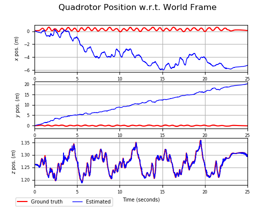
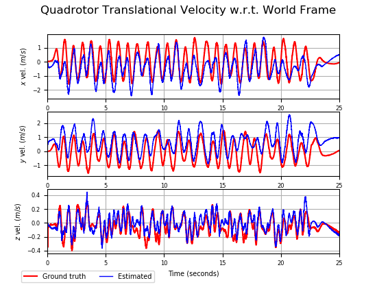

# quadrotor-vdm-aided-ins
This is a modified version of the [GeomInertiaEstimator](https://github.com/arplaboratory/GeomInertiaEstimator) ROS package.
It is repurposed for quadrotor vehicle dynamic model (VDM)-aided inertial navigation system (INS).

This algorithm only requires rotor speed control inputs and
measurements from inertial measurement unit (IMU) & barometric altimeter sensors.
Unfortunately, this results in position drift in the $x$ & $y$-axes.
However, we can still estimate the velocity by incorporating drag force into the VDM 
as shown in the figure below.

<p align="center">
  
  
</p>

The _Jupyter Notebook_ explaining this nonlinear observability analysis can be accessed in [PyNOA](https://github.com/BagaskaraPutra/PyNOA)

We also add an additional dataset `geomInertiaEstimator_UKF_results.bag`. 
This dataset is the UKF estimation result of the original [GeomInertiaEstimator](https://github.com/arplaboratory/GeomInertiaEstimator) package.
It can be used as ground truth velocity data as the original dataset doesn't contain them.

## Reference

Please cite the following publications if you intend to use this package for academic context:

> B. P. Putra, A. I. Cahyadi and I. Ardiyanto, "**Quadrotor Inertial Navigation Aided by Vehicle Dynamic Model: A Nonlinear Observability Analysis,**" 2022 14th International Conference on Information Technology and Electrical Engineering (ICITEE), Yogyakarta, Indonesia, 2022, pp. 42-47, doi: 10.1109/ICITEE56407.2022.9954095.

```
@INPROCEEDINGS{9954095,
author={Putra, Bagaskara Primastya and Cahyadi, Adha Imam and Ardiyanto, Igi},
booktitle={2022 14th International Conference on Information Technology and Electrical Engineering (ICITEE)}, 
title={Quadrotor Inertial Navigation Aided by Vehicle Dynamic Model: A Nonlinear Observability Analysis}, 
year={2022},
volume={},
number={},
pages={42-47},
doi={10.1109/ICITEE56407.2022.9954095}}
```

1. The quadrotor model for VDM-aided inertial navigation is adopted from:

  > N. Y. Ko, I. H. Choi, G. Song and W. Youn, "**Three-Dimensional Dynamic-Model-Aided Navigation of Multirotor Unmanned Aerial Vehicles,**" _in IEEE Access, vol. 7, pp. 170715-170732_, 2019, doi: 10.1109/ACCESS.2019.2955756.

  ```
  @article{8911410,  
  author={Ko, Nak Yong and Choi, In Ho and Song, Gyeongsub and Youn, Wonkeun},  
  journal={IEEE Access},   
  title={Three-Dimensional Dynamic-Model-Aided Navigation of Multirotor Unmanned Aerial Vehicles}, 
  year={2019},  
  volume={7},  
  number={},  
  pages={170715-170732},  
  doi={10.1109/ACCESS.2019.2955756}}
  ```

2. The state estimation algorithm, source code, and dataset are adopted from:

  > Wüest V, Kumar V, Loianno G. "**Online Estimation of Geometric and Inertia Parameters for Multirotor Aerial Vehicles**." _2019 IEEE International Conference on Robotics and Automation (ICRA)_. IEEE, 2019.

  ```
  @inproceedings{wueest2018estimation,
    title={Online Estimation of Geometric and Inertia Parameters for Multirotor Aerial Vehicles},
    author={W{\"u}est, Valentin and Kumar, Vijay and Loianno, Giuseppe},
    booktitle={2019 IEEE International Conference on Robotics and Automation (ICRA)},
    pages={},
    year={2019},
    organization={IEEE}
  }
  ```

## License
Please be aware that this code was originally implemented for research purposes and may be subject to changes and any fitness for a particular purpose is disclaimed.
To inquire about commercial licenses, please contact [Valentin Wüest](mailto:valentinwueest@gmail.com) and [Giuseppe Loianno](mailto:loiannog@nyu.edu).
```
    This program is free software: you can redistribute it and/or modify
    it under the terms of the GNU General Public License as published by
    the Free Software Foundation, either version 3 of the License, or
    (at your option) any later version.

    This program is distributed in the hope that it will be useful,
    but WITHOUT ANY WARRANTY; without even the implied warranty of
    MERCHANTABILITY or FITNESS FOR A PARTICULAR PURPOSE.  See the
    GNU General Public License for more details.

    You should have received a copy of the GNU General Public License
    along with this program.  If not, see <https://www.gnu.org/licenses/>.
```

## Installation
Clone the _quadrotor-vdm-aided-ins_ repo into your catkin workspace:
```
cd ~/catkin_ws/src/
git clone git@github.com:BagaskaraPutra/quadrotor-vdm-aided-ins.git
```

Build the _quadrotor-vdm-aided-ins_ package:
```
catkin_make --pkg quadrotor_vdm_aided_ins --cmake-args -DCMAKE_BUILD_TYPE=Release
```

In case an error message appears, try running the last step again.

## Usage
To use the estimator, first enter the parameters of your multirotor in _config/vdm_ins_quad_params.yaml_.

Make sure that the three topics _IMU_, _pose_ and _motor rpm_ are published. 

Then, remap these topics in _launch/vdm_ins.launch_ and launch the estimator by executing:
```
roslaunch quadrotor_vdm_aided_ins vdm_ins.launch
```

## Offline Plotting Example
Open a new terminal window, execute the **vdm_ins** launch file:
```
roslaunch quadrotor_vdm_aided_ins vdm_ins.launch
```

Open a second terminal tab and play the experiment `*.bag` file:
```
roscd quadrotor_vdm_aided_ins/
rosbag play config/geomInertiaEstimator_UKF_results.bag --pause
```

In the third terminal tab, start recording the topics:
```
rosbag record -a
```

Quickly go back to the second terminal tab and press the _SPACEBAR_ to unpause the `*.bag` file.

After the `*.bag` file has finished playing, go to the third terminal tab and `Ctrl+C` to stop recording.

To plot the figures, the `*.bag` file needs to be converted into `*.csv`.
We can use the [`rosbag_to_csv`](https://github.com/AtsushiSakai/rosbag_to_csv) package to convert it.

A Python plotter code in `/results/plotter.py` can then plot these `*.csv` files.
To make it easier, put the `*.csv` files into the same folder as `plotter.py`.
We can copy the converted `*.csv` files into the `/results/` folder and run the `plotter.py` code in there.
Make sure to edit the `*.csv` filenames in the `plotter.py` accordingly:

1. `groundtruth_pose_filename` : Ground truth dataset for the pose (position & orientation) states.
1. `groundtruth_velocity_filename` : Ground truth dataset for the translational & angular velocity states.
1. `estimated_states_filename` : Estimated states of the proposed VDM-aided INS

Then run the Python plotter code:
```
roscd quadrotor_vdm_aided_ins/results/
python3 plotter.py
```

## Online Plotting Example
Firstly, install _PlotJuggler_ if you have not already:
```
sudo apt-get install ros-$ROS_DISTRO-plotjuggler
```

In a terminal window, start the roscore:
```
roscore
```

In a second terminal window, start the estimator:
```
roslaunch quadrotor_vdm_aided_ins vdm_ins.launch
```

In a third one, play the example experiment bag file:
```
roscd quadrotor_vdm_aided_ins/
rosbag play config/geomInertiaEstimator_UKF_results.bag --pause
```

You can now plot the estimates using plotjuggler by executing this command in a fourth window:
```
roscd quadrotor_vdm_aided_ins/
rosrun plotjuggler plotJuggler -l config/vdm_ins_PlotJuggler_Layout.xml
```
When prompted, hit "_Yes (Both Layout and Streaming)_", "_OK_", and "_Create empty placeholders_". You can then unpause the bag play by clicking on the rosbag terminal window and hitting _SPACEBAR_. Now, enjoy following the plots being drawn!

## Remark
If you intend to change the mathematical model of the estimator, please use the Unscented Kalman Filter (UKF) instead of the Extended Kalman Filter (EKF), as we have not yet provided the Matlab functions used to calculate the linearized state transition model.
